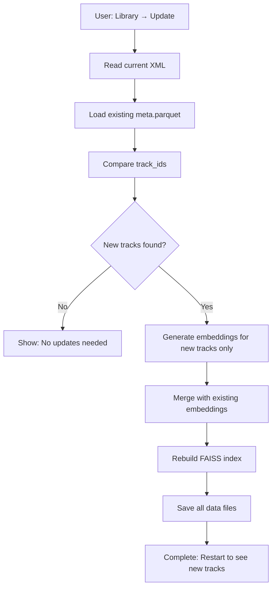

# Incremental Indexing Guide

This guide explains how users can add new tracks to their library after initial setup.

## 🔄 How Incremental Indexing Works

DJ Companion automatically detects which tracks are new and only processes those, making updates fast and efficient.

### Behind the Scenes

1. **Track Detection**: Compares current XML with existing `data/meta.parquet`
2. **Smart Processing**: Only new tracks get audio embeddings generated
3. **Merge Strategy**: New data is merged with existing index
4. **Instant Availability**: Updated tracks are available immediately

### Performance

- **First Index**: ~10-30 seconds per track (generates embeddings)
- **Incremental Update**: Only processes new tracks
- **Example**: Adding 10 new tracks to a 1000-track library takes ~3-5 minutes

## 📱 For End Users (Packaged App)

### Method 1: Quick Update (Recommended)

1. Export updated XML from Rekordbox (File → Export Collection in xml format)
2. In DJ Companion, go to **Library** menu → **Update Library (Incremental)**
3. Wait for processing to complete
4. Restart the app to see new tracks

### Method 2: Via Settings

1. Open **File** menu → **Settings**
2. Click **🔄 Update Library (Incremental)** button
3. Progress window shows real-time updates
4. Restart when complete

### Method 3: Full Re-index (Only if needed)

1. Open **File** menu → **Settings**
2. Click **🔄 Full Re-index** button
3. Confirm the action
4. Wait for complete reprocessing (this will take longer)

**When to use Full Re-index:**
- Moving your library to a new location
- Experiencing index corruption
- After major Rekordbox changes

## 💻 For Developers (Command Line)

### Incremental Update

```bash
# Export new XML from Rekordbox
# Then run:
python src/dj_companion.py index /path/to/updated_export.xml

# The system automatically detects new tracks
```

### Force Full Reindex

```bash
python src/dj_companion.py index /path/to/export.xml --force
```

### Debug with Sample Size

```bash
# Test with just 10 new tracks
python src/dj_companion.py index /path/to/export.xml --sample 10
```

## 🎯 Best Practices

### Regular Updates

1. **Weekly**: If you add tracks regularly
2. **Before DJ Sets**: Ensure latest tracks are available
3. **After Major Additions**: Process large batches when you have time

### Workflow

```
Add tracks to Rekordbox
         ↓
Export updated XML
         ↓
DJ Companion → Library → Update Library
         ↓
Wait for processing
         ↓
Restart DJ Companion
         ↓
New tracks available!
```

### Tips

- **Keep XML Updated**: Export from Rekordbox after adding tracks
- **Backup XML**: Save exports for reference
- **Monitor Progress**: Watch the log for any failed tracks
- **Restart After Update**: New tracks appear after app restart

## 🔍 Troubleshooting

### "No new tracks to process"

✅ **This is normal** if you haven't added tracks since last index
- The system checked and found no changes
- Your library is up to date

### "File not found" errors

- **Check Audio Paths**: Ensure track files are accessible
- **Update Rekordbox**: Export fresh XML if files moved
- **Network Drives**: May timeout; consider local copies

### Tracks missing after update

1. Check if they appear in Rekordbox XML export
2. Verify file paths are correct
3. Try **Full Re-index** from Settings

### Large library updates are slow

This is expected! Processing time depends on:
- **Number of new tracks**
- **Audio file formats** (some decode slower)
- **System speed** (CPU matters for embedding generation)

**Tip**: Use `--sample` flag to test with a few tracks first

## 📊 What Gets Updated

### Incremental Update

✅ Updates:
- New track metadata
- New audio embeddings
- FAISS search index
- Track ID mappings

❌ Doesn't Change:
- Existing track data
- Your playlists/sets
- App settings

### Full Re-index

⚠️ Completely rebuilds:
- All track embeddings
- Entire FAISS index
- All mappings

## 🚀 Performance Optimization

### Speed Up Processing

1. **Close Other Apps**: More CPU for embedding generation
2. **Use SSD**: Faster audio file reading
3. **Local Files**: Network drives add latency
4. **Modern CPU**: Embedding generation is CPU-intensive

### Estimate Processing Time

```
Time ≈ (number_of_new_tracks × 15 seconds) + 30 seconds overhead

Examples:
- 10 new tracks: ~3 minutes
- 50 new tracks: ~13 minutes
- 100 new tracks: ~26 minutes
```

## 📝 Technical Details

### Data Files Updated

```
data/
├── meta.parquet        ← Updated with new track metadata
├── embeddings.parquet  ← New embeddings appended
├── index.npy          ← Rebuilt with combined vectors
├── ids.json           ← Updated track ID list
└── settings.json      ← XML path stored here
```

### Process Flow



### Code Reference

The incremental logic is in:
- `processing/pipeline.py` - Main indexing orchestration
- `core/loader.py` - `find_new_tracks()` function
- `core/persistence.py` - `merge_embeddings()` function

## 🎨 UI Features

### Settings Window

- **View Statistics**: Total tracks, last indexed date, index size
- **Change XML Path**: Update if library moved
- **Quick Actions**: One-click update or full reindex

### Progress Window

- **Real-time Log**: See each track as it processes
- **Error Reporting**: Failed tracks are clearly marked
- **Completion Status**: Know when it's safe to restart

### Menu Shortcuts

- **Library → Update Library**: Quick incremental update
- **File → Settings**: Full control panel
- **Help → About**: Version information

## 🔐 Safety

### Your Data is Safe

- **Non-Destructive**: Original audio files never modified
- **Separate Index**: DJ Companion data stored in `data/` directory
- **Recoverable**: Delete `data/` directory to start fresh
- **No Cloud Sync**: Everything stays local

### If Something Goes Wrong

```bash
# Reset everything
rm -rf data/

# Then restart the app
# First-run onboarding will appear again
```
