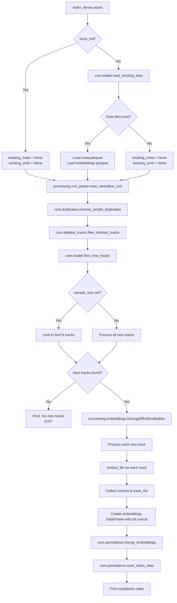
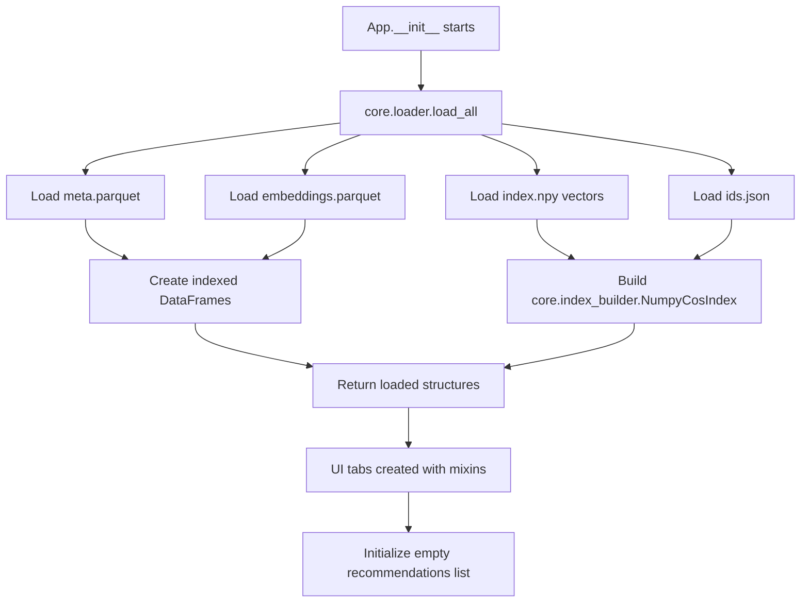
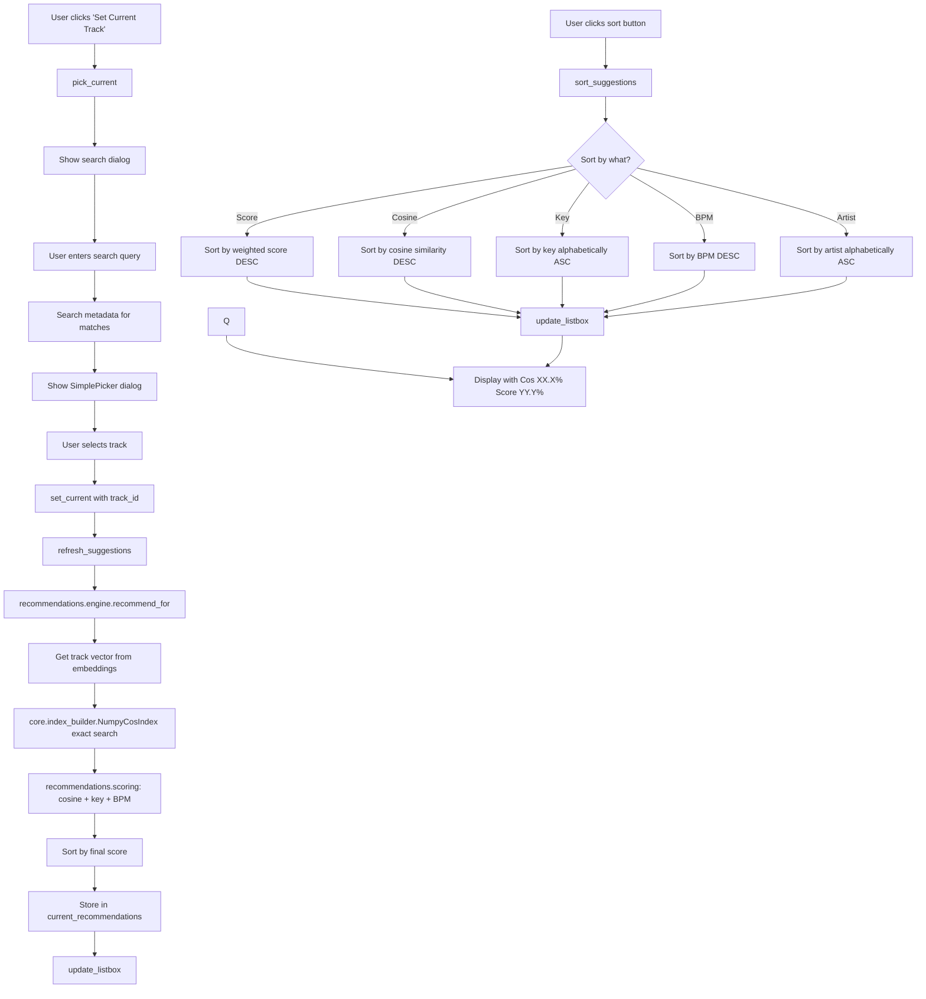

# Cosine Companion - Program Flow Documentation

> **Related Documentation:**
> - [System Architecture](SYSTEM_ARCHITECTURE.md) - High-level architecture and component design
> - [Embeddings Guide](EMBEDDINGS_GUIDE.md) - Audio embedding extraction and similarity search
> - [Build Instructions](BUILD_INSTRUCTIONS.md) - Building standalone applications

This document provides a comprehensive overview of how the Cosine Companion system works, including exact execution flow, component interactions, and data flow diagrams.

## 🏗️ System Architecture Overview

```
┌─────────────────────────────────────────────────────────────────┐
│                        COSINE COMPANION SYSTEM                      │
├─────────────────────────────────────────────────────────────────┤
│  CLI Entry Point: cosine_companion.py                               │
│  ├── index command → processing.pipeline                        │
│  └── ui command → web.host (ui.App fallback)                    │
└─────────────────────────────────────────────────────────────────┘
         │                                    │
         ▼                                    ▼
┌─────────────────────┐           ┌───────────────────────────┐
│  INDEXING FLOW      │           │   UI/APP FLOW             │
│                     │           │                           │
│ processing/         │           │ ui/                       │
│ ├─ pipeline.py      │           │ ├─ app.py                 │
│ ├─ xml_parser.py    │           │ ├─ recommendations_tab.py │
│ └─ embeddings.py    │           │ ├─ set_creator_tab.py     │
│                     │           │ ├─ library_tab.py         │
│ core/               │           │ └─ dialogs.py             │
│ ├─ loader.py        │           │                           │
│ ├─ persistence.py   │           │ recommendations/          │
│ ├─ index_builder.py │           │ ├─ engine.py              │
│ ├─ duplicates.py    │           │ ├─ scoring.py             │
│                     │           │ └─ set_generator.py       │
│ config/             │           │                           │
│ ├─ paths.py         │           │ core/                     │
│ └─ defaults.py      │           │ ├─ loader.py              │
└─────────────────────┘           │ └─ index_builder.py       │
         │                        └───────────────────────────┘
         ▼                                    │
┌─────────────────────────────────────────────────────────────────┐
│                     SHARED DATA LAYER                           │
│  config/paths.py → data/ directory                              │
│  ├── meta.parquet     (track metadata)                          │
│  ├── embeddings.parquet (audio embeddings)                      │
│  ├── index.npy        (exact-search vectors)                    │
│  └── ids.json         (track ID mapping)                        │
│  └── deleted_tracks.json (manually deleted track IDs)           │
└─────────────────────────────────────────────────────────────────┘
```

## 🚀 Program Entry Points

### Command Line Interface (cosine_companion.py)

```python
# Entry point structure
if __name__ == "__main__":
    cli()  # Typer CLI dispatcher
```

**Available Commands:**
1. `python src/cosine_companion.py index <xml_file> [--force] [--sample N]`
2. `python src/cosine_companion.py ui [--debug] [--data-dir <directory>]`
3. `python src/cosine_companion.py ui-web` (strict web-only compatibility alias)
4. `python src/cosine_companion.py ui-tk` (classic interface directly)
5. `python src/cosine_companion.py clean-duplicates <xml_file>`

---

## 📊 INDEXING FLOW (Detailed)

When you run: `python cosine_companion.py index rekordbox_export.xml`

### Phase 1: CLI Command Parsing

```
cosine_companion.py:index()
│
├─ Argument: xml (Rekordbox XML file path)
├─ Option: --force (boolean, default False)
├─ Option: --sample N (integer, optional debug sample size)
│
└─ Calls: processing.pipeline.index_library(xml, force_full=force, sample_size=sample)
```

### Phase 2: Incremental Index Pipeline



### Detailed Component Calls in Indexing:

#### 1. **processing.pipeline.index_library(rb_xml, force_full=False, sample_size=None)**
```python
def index_library(rb_xml: str, force_full: bool = False, sample_size: int | None = None):
    # Step 1: Load existing data (unless force)
    if force_full:
        existing_meta, existing_emb = None, None
    else:
        from core.loader import load_existing_data
        existing_meta, existing_emb = load_existing_data()
    
    # Step 2: Parse current XML
    from processing.xml_parser import read_rekordbox_xml
    current_meta = read_rekordbox_xml(rb_xml)
    
    # Step 2.5: Remove duplicates
    from core.duplicates import remove_simple_duplicates
    current_meta, duplicates_info = remove_simple_duplicates(current_meta)

    # Step 2.6: Filter manually deleted tracks
    from core.deleted_tracks import filter_deleted_tracks
    current_meta = filter_deleted_tracks(current_meta)
    
    # Step 3: Find new tracks
    from core.loader import find_new_tracks
    new_tracks = find_new_tracks(current_meta, existing_meta)
    
    # Step 4: Apply sample limit if debugging
    if sample_size is not None:
        new_tracks = new_tracks.head(sample_size)
    
    # Step 5: Process new tracks
    from processing.embeddings import DiscogsEffnetEmbedder
    embedder = DiscogsEffnetEmbedder()
    for track in new_tracks:
        vector = embedder.embed_file(track.path_local)
    
    # Step 6: Create DataFrame efficiently (no fragmentation warnings)
    v_cols = [f"v{i}" for i in range(new_vectors_array.shape[1])]
    new_emb_df = pd.concat([
        pd.DataFrame({"track_id": new_track_ids}),
        pd.DataFrame(new_vectors_array, columns=v_cols)
    ], axis=1)
    
    # Step 7: Merge and save
    from core.persistence import merge_embeddings, save_index_data
    combined_emb, combined_vectors, combined_track_ids = merge_embeddings(
        existing_emb, new_emb_df, new_track_ids, new_vectors_array
    )
    # Metadata merge preserves any previously indexed tracks that are no longer in the XML
    combined_meta = current_meta if existing_meta is None else merge_metadata(existing_meta, current_meta, combined_track_ids)
    save_index_data(combined_meta, combined_emb, combined_vectors, combined_track_ids)
```

#### 2. **processing.xml_parser.read_rekordbox_xml(xml_path)**
```python
def read_rekordbox_xml(xml_path: str) -> pd.DataFrame:
    # Parse XML using lxml
    tree = etree.parse(xml_path)
    root = tree.getroot()
    
    # Extract track data with robust URL decoding
    for track in root.xpath("//COLLECTION/TRACK"):
        location = track.get("Location") or ""
        parsed = urlparse(location)
        path_local = ""
        if parsed.scheme == "file":
            # Preserve literal '#' characters in filenames
            path_with_fragment = parsed.path + ("#" + parsed.fragment if parsed.fragment else "")
            if parsed.netloc and parsed.netloc != "localhost":
                path_local = "/" + parsed.netloc + unquote(path_with_fragment)
            else:
                path_local = unquote(path_with_fragment)

        track_id = track.get("TrackID") or ""
        if not track_id:
            track_id = location  # fallback when TrackID is missing

        extract_metadata(track)  # artist, title, bpm, key, etc.
    
    # Return DataFrame with verified local file paths
    return processed_dataframe
```

#### 3. **processing.embeddings.DiscogsEffnetEmbedder.embed_file(path)**
```python
def embed_file(self, path_local: str) -> np.ndarray:
    # Load audio using Essentia's MonoLoader
    loader = es.MonoLoader(filename=path_local, sampleRate=self.sr, resampleQuality=4)
    audio = loader()
    
    # Use Essentia's recommended approach
    # Call TensorflowPredictEffnetDiscogs once on whole audio
    pred_out = self.pred(audio)  # output="PartitionedCall:1"
    Y = np.asarray(pred_out)
    
    # Pool if model outputs multiple embeddings
    if Y.ndim == 1:
        pooled = Y
    elif Y.ndim == 2:
        pooled = np.concatenate([Y.mean(axis=0), Y.std(axis=0)])
    else:
        Y2 = Y.reshape(Y.shape[0], -1)
        pooled = np.concatenate([Y2.mean(axis=0), Y2.std(axis=0)])
    
    # L2 normalize
    return pooled / (np.linalg.norm(pooled) + 1e-9)
```

### Data Files Created/Updated:

```
data/
├── meta.parquet        ← Current XML metadata
├── embeddings.parquet  ← Track embeddings with IDs
├── index.npy          ← Normalized vectors for exact cosine search
└── ids.json           ← Track ID → vector index mapping
└── deleted_tracks.json ← Tracks manually hidden from indexing
```

---

## 🎵 UI/APPLICATION FLOW (Detailed)

When you run: `python src/cosine_companion.py ui`

### Phase 1: Application Startup

```
cosine_companion.py:ui()
│
└─ Calls: _run_default_frontend()
   ├─ web.host.run_web_ui()
   │  ├─ Load a LibrarySession and assemble the JSON API
   │  ├─ Bind a token-protected loopback server on an ephemeral port
   │  └─ Create a pywebview window and start WKWebView
   └─ On web Exception or SystemExit: explain the cause, then ui.run_ui()
      ├─ Creates the retained ui.app.App() Tkinter interface
      └─ If Tk raises Exception or SystemExit: report both causes, then re-raise
```

The packaged `.app` no-argument/Finder path uses the same default launcher
before Typer is imported. `KeyboardInterrupt` is deliberately excluded from
both recovery handlers, so Ctrl-C exits instead of opening another interface.
Missing or inconsistent library data opens the web empty state; it is not
treated as a frontend startup failure.

### Phase 2: Classic Fallback Data Loading Process

The following is the retained Tkinter fallback path (`ui-tk` or an automatic
fallback after web startup fails):



#### **core.loader.load_all() - Detailed Flow**
```python
def load_all():
    from config import META_PQ, EMB_PQ, IDX_NPY, IDS_JSON
    from core.index_builder import NumpyCosIndex
    
    # Load saved data files
    meta = pd.read_parquet(META_PQ)           # Track metadata
    emb = pd.read_parquet(EMB_PQ)             # Embeddings with track_ids
    V = np.load(IDX_NPY)                      # Vector matrix
    with open(IDS_JSON) as f:
        ids = json.load(f)                    # Track ID list
    
    # Validate alignment, then build the exact cosine index
    validate_index_data(V, ids, emb)
    idx = NumpyCosIndex(V.shape[1])           # → core.index_builder
    for track_id, vector in zip(ids, V):
        idx.add(track_id, vector)             # Vectors normalized in add()
    
    # Create indexed DataFrames for fast lookup
    meta_ix = meta.set_index("track_id")
    emb_ix = emb.set_index("track_id")
    
    return meta, meta_ix, emb_ix, idx, V, ids
```

### Phase 3: Enhanced User Interaction Flow



#### **Enhanced UI Components**

```python
def __init__(self):
    # ... existing setup ...
    
    # Main buttons (Back, Set Current, Copy, Set Selected as Current)
    btns = tk.Frame(self)
    tk.Button(btns, text="← Back", command=self.go_back)
    tk.Button(btns, text="Set Current Track", command=self.pick_current)
    tk.Button(btns, text="Copy Selected to Clipboard", command=self.copy_selected)
    tk.Button(btns, text="Set Selected as Current", command=self.set_selected_as_current)
    
    # Sorting + Top-N display limit
    sort_frame = tk.Frame(self)
    tk.Label(sort_frame, text="Sort by:")
    tk.Button(sort_frame, text="Score", command=lambda: self.sort_suggestions("score"))
    tk.Button(sort_frame, text="Cosine", command=lambda: self.sort_suggestions("cosine"))
    tk.Button(sort_frame, text="Key", command=lambda: self.sort_suggestions("key"))
    tk.Button(sort_frame, text="BPM", command=lambda: self.sort_suggestions("bpm"))
    tk.Button(sort_frame, text="Artist", command=lambda: self.sort_suggestions("artist"))
    self.topn_var = tk.StringVar(value="50")
    ttk.Combobox(sort_frame, textvariable=self.topn_var, values=["10", "20", "30", "50", "100", "200"], state="readonly")
    
    # Store recommendations for sorting
    self.current_recommendations: List[Dict[str, Any]] = []
```

#### **New Sorting Functionality**

```python
def sort_suggestions(self, sort_by: str):
    """Sort current recommendations by the specified field."""
    if not self.current_recommendations:
        return
    
    # Define sort logic
    if sort_by == "score":
        key_func = lambda x: float(x.get('score', 0))
        reverse = True  # Highest first
    elif sort_by == "cosine":
        key_func = lambda x: float(x.get('cosine', 0))
        reverse = True  # Highest first
    elif sort_by == "key":
        key_func = lambda x: str(x.get('key', ''))
        reverse = False  # Alphabetical
    elif sort_by == "bpm":
        key_func = lambda x: float(x.get('bpm', 0) or 0)
        reverse = True  # Highest first
    elif sort_by == "artist":
        key_func = lambda x: str(x.get('artist', '')).lower()
        reverse = False  # Alphabetical
    
    # Apply sort and refresh display
    self.current_recommendations.sort(key=key_func, reverse=reverse)
    self.update_listbox()

def update_listbox(self):
    """Separate display logic for clean sorting."""
    self.listbox.delete(0, tk.END)

    try:
        topn = int(self.topn_var.get())
    except Exception:
        topn = 50

    for r in self.current_recommendations[:topn]:
        cosine = float(r.get('cosine', 0))
        score = float(r.get('score', 0))
        cos_pct = cosine * 100.0
        score_pct = max(0.0, min(1.0, score)) * 100.0
        line = f"{r['artist']} – {r['title']}   [Key {r['key'] or '?'}  BPM {r['bpm'] or '?'}  Cos {cos_pct:.1f}%  Score {score_pct:.1f}%]"
        self.listbox.insert(tk.END, line)

    self.status.config(text=f"Showing {self.listbox.size()} of {len(self.current_recommendations)} recommendations")
```

#### **Recommendation Generation - Step by Step**

```python
# 1. User sets current track
def set_current(self, track_id: str):
    self.current_id = track_id
    self.refresh_suggestions()

# 2. Generate and store recommendations
def refresh_suggestions(self):
    if not self.current_id:
        self.current_recommendations = []
        self.update_listbox()
        return
    
    # Get more candidates than we display to keep Top-N consistent
    self.current_recommendations = recommend_for(
        self.current_id,      # Source track
        self.meta_ix,         # Metadata lookup
        self.emb_ix,          # Embeddings lookup  
        self.idx,             # Exact cosine index
        topk=500,
        final_top=200
    )
    # Default sort is pure cosine similarity
    self.current_recommendations.sort(key=lambda x: x['cosine'], reverse=True)
    self.update_listbox()
```

#### **recommendations.engine.recommend_for() - Exact Cosine Search**
```python
def recommend_for(track_id, meta_ix, emb_ix, idx, topk=200, final_top=15):
    from recommendations.scoring import key_compat, bpm_compat, final_score
    
    # Step 1: Get source track vector (normalized)
    src_vector = vector_for(track_id, emb_ix)     # Defensive normalization
    src_meta = meta_ix.loc[track_id]              # Source metadata (row)
    
    # Step 2: Exact full-collection cosine search
    nbrs = idx.search(src_vector, k=topk+1)       # → core.index_builder
    # Returns: [(track_id, exact_cosine), ...]
    
    # Step 3: Blend each exact cosine score with metadata compatibility
    recommendations = []
    for candidate_id, cosine_similarity in nbrs:
        if candidate_id == track_id: continue      # Skip self
        
        target_meta = meta_ix.loc[candidate_id]
        
        # Calculate compatibility scores
        key_score = key_compat(src_meta.get("key"), target_meta.get("key"))
        bpm_score = bpm_compat(src_meta.get("bpm"), target_meta.get("bpm"))
        score = final_score(cosine_similarity, key_score, bpm_score)
        
        recommendations.append({
            "track_id": candidate_id,
            "artist": target_meta.get("artist", ""),
            "title": target_meta.get("title", ""),
            "bpm": target_meta.get("bpm", None),
            "key": target_meta.get("key", ""),
            "score": score,
            "cosine": cosine_similarity,
            "key_score": key_score,
            "bpm_score": bpm_score,
        })
    
    # Step 4: Sort by final score and return top results
    recommendations.sort(key=lambda x: x["score"], reverse=True)
    return recommendations[:final_top]
```

### Scoring Components Detail

#### **recommendations.scoring Functions Called:**

1. **key_compat(src_key, dst_key)**
   ```python
   # Convert to Camelot wheel notation (expanded mapping)
   src_camelot = to_camelot(src_key)    # e.g., "Am" → "8A", "G#m" → "4A"
   dst_camelot = to_camelot(dst_key)
   
   # Calculate harmonic compatibility
   if same_key: return 1.0
   if adjacent_keys: return 0.8         # ±1 on Camelot wheel
   if relative_major_minor: return 0.6  # 8A ↔ 8B
   if two_steps_away: return 0.4        # ±2 on wheel
   else: return 0.0
   ```

2. **bpm_compat(src_bpm, dst_bpm)**
   ```python
   # Check direct BPM match (±6% tolerance)
   if within_tolerance(src_bpm, dst_bpm, 0.06): return 1.0
   
   # Check half/double tempo matches
   for multiplier in [0.5, 2.0]:
       if within_tolerance(src_bpm * multiplier, dst_bpm, 0.06): return 0.7
   
   return 0.0
   ```

3. **final_score(cosine, key, bmp, weights=(0.7, 0.2, 0.1))**
   ```python
   return 0.7*cosine + 0.2*key + 0.1*bmp
   ```

---

## 🔄 Complete System Data Flow

```
┌─────────────────┐    ┌─────────────────┐    ┌─────────────────┐
│  Rekordbox XML  │    │  Audio Files    │    │  User Input     │
│                 │    │  (.mp3, .wav)   │    │  (UI clicks)    │
└─────────┬───────┘    └─────────┬───────┘    └─────────┬───────┘
          │                      │                      │
          ▼                      ▼                      ▼
┌─────────────────┐    ┌─────────────────┐    ┌─────────────────┐
│ processing/     │    │ processing/     │    │ ui/             │
│ xml_parser.py   │    │ embeddings.py   │    │ app.py          │
│ XML parsing     │    │ Audio→Vectors   │    │ Main window     │
│ URL decoding    │    │ Essentia model  │    │ Tabbed UI       │
└─────────┬───────┘    └─────────┬───────┘    └─────────┬───────┘
          │                      │                      │
          └──────────────────────┼──────────────────────┘
                                 │
                                 ▼
                    ┌─────────────────────────┐
                    │ processing/pipeline.py  │
                    │ Orchestration           │
                    │ Incremental indexing    │
                    └─────────┬───────────────┘
                              │
                              ▼
                    ┌─────────────────────────┐
                    │ core/persistence.py     │
                    │ Save data files         │
                    │ (.parquet, .npy, .json) │
                    └─────────┬───────────────┘
                              │
                              ▼
                    ┌─────────────────────────┐
                    │ core/loader.py          │
                    │ Load all data           │
                    │ Build NumPy matrix      │
                    └─────────┬───────────────┘
                              │
                              ▼
         ┌──────────────────────┴──────────────────────┐
         │                                              │
         ▼                                              ▼
┌─────────────────┐                        ┌─────────────────┐
│ core/           │                        │ recommendations/│
│ index_builder.py│◄──────────────────────►│ engine.py       │
│ Exact Cosine    │                        │ recommend_for() │
│ Full collection │                        │ Blended scoring │
└─────────────────┘                        └────────┬────────┘
                                                    │
                                                    ▼
                                           ┌─────────────────┐
                                           │ recommendations/│
                                           │ scoring.py      │
                                           │ Key/BPM Compat  │
                                           │ Extended keys   │
                                           └─────────────────┘
```

## 📋 Component Responsibility Matrix

| Package | Module | Primary Role | Key Functions | Dependencies |
|---------|--------|--------------|---------------|--------------|
| **root** | **cosine_companion.py** | CLI Entry Point | `index()`, `ui()`, `clean_duplicates()` | processing, ui, core |
| **config/** | **paths.py** | File Path Configuration | Path constants | pathlib |
| **config/** | **defaults.py** | Default Parameters | Constants | None |
| **core/** | **loader.py** | Data Loading | `load_all()`, `load_existing_data()`, `find_new_tracks()` | pandas, config |
| **core/** | **persistence.py** | Data Saving | `save_index_data()`, `merge_embeddings()` | pandas, numpy, config |
| **core/** | **index_builder.py** | Similarity Search | `NumpyCosIndex.search()` | numpy |
| **core/** | **duplicates.py** | Duplicate Detection | `remove_simple_duplicates()` | pandas, os |
| **core/** | **deleted_tracks.py** | Deleted Track Management | `filter_deleted_tracks()` | json, pandas |
| **processing/** | **pipeline.py** | Indexing Orchestration | `index_library()` | All core, processing modules |
| **processing/** | **xml_parser.py** | XML Parsing | `read_rekordbox_xml()` | lxml, pandas, urllib |
| **processing/** | **embeddings.py** | Audio Processing | `DiscogsEffnetEmbedder.embed_file()` | essentia, numpy |
| **recommendations/** | **engine.py** | Recommendations | `recommend_for()`, `vector_for()` | core, scoring |
| **recommendations/** | **scoring.py** | Compatibility Scoring | `key_compat()`, `bpm_compat()`, `final_score()` | None |
| **recommendations/** | **set_generator.py** | DJ Set Generation | `generate_set()` | engine, transitions, models |
| **recommendations/** | **playlist_exporter.py** | Playlist Export | `export_recommendations_as_playlists()`, `export_single_playlist()` | engine, core |
| **recommendations/** | **models.py** | Data Models | `SetTrack` dataclass | dataclasses |
| **recommendations/** | **transitions.py** | Transition Scoring | `calculate_transition_score()` | engine, numpy |
| **recommendations/** | **search.py** | Track Search | `search_tracks()` | pandas |
| **ui/** | **app.py** | Main Application | `App` class, mixins | core, tkinter |
| **ui/** | **recommendations_tab.py** | Recommendations UI | Tab creation & logic | recommendations.engine |
| **ui/** | **set_creator_tab.py** | Set Creator UI | Tab creation & logic | recommendations |
| **ui/** | **playlist_export_tab.py** | Playlist Export UI | Tab creation & logic | recommendations.playlist_exporter |
| **ui/** | **library_tab.py** | Library Management | Tab creation & deletion | core |
| **ui/** | **dialogs.py** | UI Dialogs | `SimplePicker`, `AddAnchorDialog` | tkinter, recommendations |
| **ui/** | **track_selector_dialog.py** | Track Selector Dialog | `TrackSelectorDialog` | tkinter, recommendations.search |

## ⚡ Performance Characteristics

### Indexing Performance:
- **First Run**: O(n) where n = number of tracks (must process all)
- **Incremental**: O(k) where k = number of new tracks (k << n)
- **Bottleneck**: Audio file I/O and embedding computation
- **Sample Mode**: O(sample_size) for debugging/testing

### Search Performance:
- **Exact Cosine Search**: O(n × d) matrix-vector scoring across the full collection
- **Scoring**: O(k) where k = number of candidates (typically 200)
- **UI Update**: O(k) for displaying results
- **Sorting**: O(k log k) for recommendation sorting

### Memory Usage:
- **Embeddings**: ~10KB per track for 2,560 float32 values
- **Cosine Index**: one float32 matrix with no graph overhead
- **Metadata**: ~100 bytes per track
- **UI State**: ~50KB for current recommendations list

### UI Features:
- **Tabbed Interface**: Four main tabs (Explore, Set Creator, Playlist Export, Library)
- **Interactive Sorting**: Sort by Score, Cosine, Key, BPM, or Artist
- **Top-N Selector**: Control how many recommendations are shown (10–200)
- **Persistent State**: Recommendations cached until track change
- **Dual Score Display**: Both raw cosine (Cos XX.X%) and weighted score (Score YY.Y%)
- **History Navigation**: Back button to navigate through track selections
- **DJ Set Generation**: Anchor-based set creation with transition scoring
- **Library Management**: Browse, search, and delete tracks with multi-select
- **Modular Architecture**: Clean separation with tab-specific mixins

## 🏛️ Architectural Principles

The refactored codebase follows these key principles:

1. **Separation of Concerns**: Each package has a single, well-defined responsibility
   - `config/`: Configuration only
   - `core/`: Data management and indexing
   - `processing/`: Audio processing and pipeline orchestration
   - `recommendations/`: Recommendation logic and scoring
   - `ui/`: User interface components

2. **Modularity**: Large files split into focused modules (90-270 lines each)
   - Easier to understand, test, and maintain
   - Clear interfaces between components
   - Independent modules can be developed separately

3. **Dependency Flow**: Clear hierarchy prevents circular dependencies
   ```
   config/ (no dependencies)
     ↓
   core/ (uses config)
     ↓
   processing/ (uses core, config)
     ↓
   recommendations/ (uses core, config)
     ↓
   ui/ (uses core, recommendations)
   ```

4. **Testability**: Isolated components with clear interfaces
   - Each module can be tested independently
   - Mock dependencies easily in unit tests
   - Integration tests validate data flow

This architecture ensures efficient, scalable operation while maintaining clear separation of concerns between components and providing enhanced user interaction capabilities.
